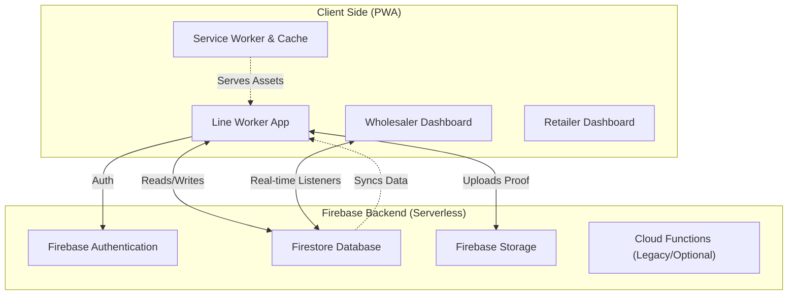
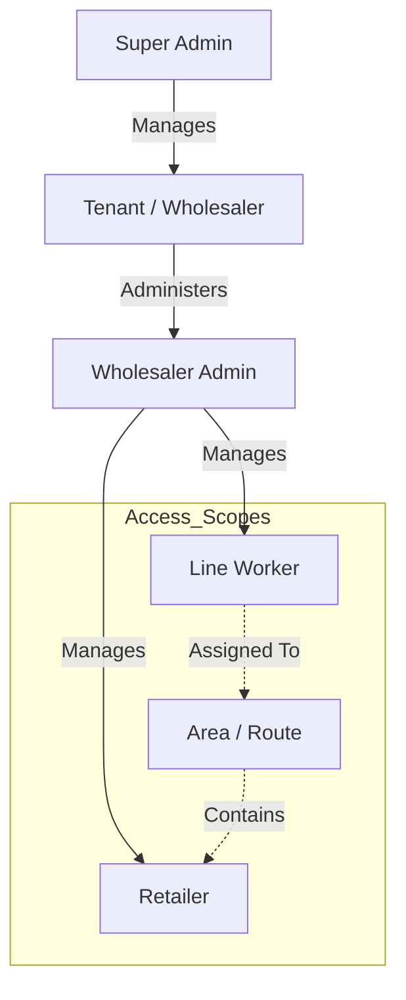
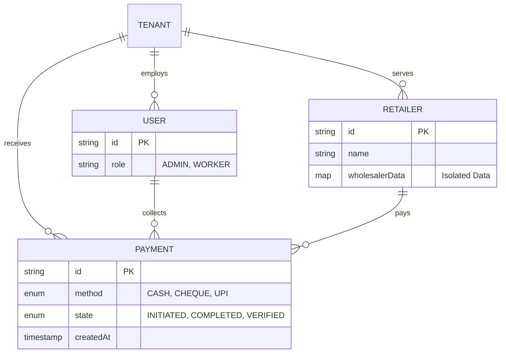
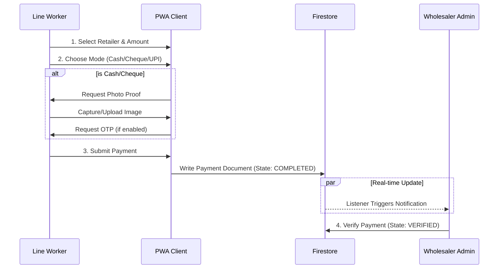

# 🏥 pHLynk (PharmaLync) - Master Documentation

> **Note:** This document is the **comprehensive source of truth** for the pHLynk project. It accurately reflects the current codebs ase state, including Next.js 16, Firebase 12, PWA features, and the latest business logic for payment collection and worker assignment....

## 📋 Table of Contents
- [Project Overview](#project-overview)
- [Technology Stack](#technology-stack)
- [System Architecture](#system-architecture)
- [User Roles & Permissions](#user-roles--permissions)
- [Data Models & Schema](#data-models--schema)
- [Core Workflows](#core-workflows)
  - [Payment Collection (Cash/Cheque/UPI)](#payment-collection)
  - [Cheque Management](#cheque-management)
  - [OTP & Verification](#otp--verification)
- [Dashboard Features](#dashboard-features)
- [PWA & Offline Capabilities](#pwa--offline-capabilities)
- [Recent Architecture Changes (March 2026)](#-recent-architecture-changes-march-2026)
  - [Retailer Search Performance Optimization](#1-retailer-search-performance-optimization)
  - [Backfill Scripts](#2-backfill-scripts)
  - [Data Cleanup](#3-data-cleanup)
  - [Cloud Functions Deployment](#4-cloud-functions-deployment)
  - [Current Architecture Summary](#5-current-architecture-summary)
  - [Known Cost Optimization Opportunities](#6-known-cost-optimization-opportunities)
  - [Firestore Persistence & Connectivity](#7-firestore-persistence--connectivity)
  - [FCM & Notification Pipeline Fix](#8-fcm--notification-pipeline-fix)
- [Old Search Architecture (Pre-March 2026)](#-old-search-architecture-pre-march-2026)
- [Setup & Development](#setup--development)

---

## 🚀 Project Overview
**pHLynk** is a specialized payment collection and reconciliation system for the pharmaceutical supply chain. It bridges the gap between **Wholesalers**, **Line Workers** (Field Agents), and **Retailers** (Pharmacies), enabling efficient, secure, and verifiable payment collection.

### Key Problems Solved
1.  **Payment Verification**: Eliminates fraud via OTP verification and photo evidence for cash/cheque.
2.  **Real-time Visibility**: Wholesalers see collections instantly as they happen in the field.
3.  **Offline Resilience**: Line workers can operate in areas with poor connectivity (PWA).
4.  **Complex Assignments**: Supports multi-wholesaler assignments for retailers and multi-worker coverage for areas.

---

## 🛠 Technology Stack

### Frontend & Application Framework
*   **Framework**: [Next.js 16.1.0 (App Router)](https://nextjs.org/)
*   **Language**: [TypeScript 5.x](https://www.typescriptlang.org/)
*   **UI Library**: [React 19.0.0](https://react.dev/)
*   **Styling**: 
    *   [Tailwind CSS 4.0](https://tailwindcss.com/)
    *   [Shadcn/UI](https://ui.shadcn.com/) (Radix UI Primitives)
    *   **Icons**: Lucide React
*   **Animations**: Framer Motion
*   **Charts**: Recharts

### Backend & Database (Serverless)
*   **Primary Database**: **Firebase Firestore** (NoSQL, Real-time)
*   **Authentication**: **Firebase Authentication** (Email/Password, Google)
*   **Storage**: **Firebase Storage** (Payment Proof Images)
*   **Real-time Engine**: Firestore `onSnapshot` listeners (Primary)
    *   *Note*: `socket.io` is present in dependencies but Firestore is the active real-time mechanism for dashboards.

### Mobile & PWA
*   **PWA**: Fully installable Progressive Web App.
*   **Capabilities**: Offline caching, Camera access, Biometric support (device dependent), "App-like" navigation trapping.
*   **Offline Persistence**: Firestore IndexedDB `persistentLocalCache` with `persistentMultipleTabManager` (Firebase 12.x API).
*   **FCM Push Notifications**: Unified Service Worker handles both PWA caching and Firebase Cloud Messaging.

---

## 🏗 System Architecture

pHLynk follows a **Client-Heavy, Serverless** architecture to ensure responsiveness and offline capability.

### 1. The "Thick" Client (PWA)
*   **Role**: Handles business logic, validations (duplicate payments), OTP generation hashing, and optimistic UI updates.
*   **State Management**: Complex React Context (`AuthProvider`) + Local State.
*   **Offline Handling**: Service Workers cache static assets; Firestore SDK handles offline data persistence and sync when online.

### 2. The Backend (Firebase)
*   **Firestore**: Stores all relational data (Users, Payments, Retailers). Uses composite indexes for complex querying (e.g., "Recent Payments by Line Worker").
*   **Security Rules**: Enforces data isolation between Tenants (Wholesalers).

### System Architecture Diagram


### 3. Data Isolation Model
*   **Multi-Tenancy**: The system is multi-tenant.
    *   **Tenants**: Wholesalers.
    *   **Users**: Can belong to a single tenant (Wholesaler Admin) or span multiple (Retailers).
    *   **Data Partitioning**: Retailer assignments are stored in a `wholesalerData` map within the Retailer document, ensuring one wholesaler cannot see another's specific business data (credit limits, balances) for the same retailer.

---

## 👥 User Roles & Permissions

| Role | Access Level | Description |
| :--- | :--- | :--- |
| **SUPER_ADMIN** | System Wide | Can create Tenants (Wholesalers), manage subscriptions, view global analytics. |
| **WHOLESALER_ADMIN** | Tenant Scope | Manages their own Retailers, Line Workers, Areas. Views financial reports and verifies payments. |
| **LINE_WORKER** | Area Scope | Field agent. Collects payments, uploads proof. Can only see assigned Retailers. |
| **RETAILER** | Personal Scope | The pharmacy owner. Views their own payment history, dues, and invoices. |

### Role Hierarchy


---

## 📊 Data Models & Schema

This section outlines the core TypeScript interfaces driving the application.

### 1. Payment (`src/types/index.ts`)
The central entity of the system.
```typescript
interface Payment {
  id: string;
  amount: number;
  method: 'CASH' | 'CHEQUE' | 'UPI' | 'ONLINE';
  state: 'INITIATED' | 'COMPLETED' | 'VERIFIED' | 'CANCELLED';
  
  // Relationships
  tenantId: string;       // The Wholesaler
  lineWorkerId: string;   // Who collected it
  retailerId: string;     // Who paid it
  
  // Cheque Specifics (New Capability)
  chequeNumber?: string;
  chequeDate?: string;    // ISO Date
  bankName?: string;
  
  // Verification
  otp?: { hash: string; expiresAt: Timestamp };
  evidence: { storagePath: string; url: string }[];
  verified: boolean;      // Wholesaler admin verification status
  
  // Metadata
  createdAt: Timestamp;
}
```

### 2. Retailer (`src/types/index.ts`)
A complex entity that maintains relationships with multiple wholesalers.
```typescript
interface Retailer {
  id: string;
  name: string;
  phone: string;
  
  // Isolated Data Per Wholesaler
  wholesalerData?: {
    [tenantId: string]: {
      currentAreaId: string;
      code: string;           // Wholesaler-specific custom code
      creditLimit?: number;
      currentBalance?: number;
    }
  };

  // Assignments
  assignedLineWorkerIds?: string[]; // Supports multiple workers visiting same retailer
}
```

### Entity Relationship Diagram


---

## 🔄 Core Workflows

### 1. Payment Collection Flow
1.  **Initiation**: Line Worker selects a Retailer > "Collect Payment".
2.  **Mode Selection**:
    *   **Cash**: Requires Photo Proof + OTP (sent to Retailer phone).
    *   **Cheque**: Requires Photo + Cheque Details (Bank, No, Date) + OTP.
    *   **UPI**: Scans QR / Enters UTR.
3.  **Validation**:
    *   System checks for **Duplicate Payments** (same amount + same retailer + short time window) -> Shows Warning Dialog.
4.  **Submission**: Data writes to Firestore. Notification triggers for Wholesaler.

### 2. Cheque Management
*   **48-Hour Edit Window**: Line Workers can edit Cheque details (Bank Name, Number) for up to 48 hours after collection to fix typos.
*   **Verification**: Wholesaler Admin sees "Cheque" badge and must manually verify receipt of the physical instrument.

### Payment Collection Workflow


### 3. Payment Verification (Admin)
1.  Wholesaler Admin opens **Transactions Tab**.
2.  Views Payment Proof (Zoom/Pan supported).
3.  Marks payment as `VERIFIED` or flags issues.
4.  Payments can be **Deleted** if erroneous (with confirmation dialog).

---

## 📱 Dashboard Features

### Line Worker Dashboard
*   **Recent Activity**: Shows payments from last **30 days** (Optimized Query).
*   **Offline Mode**: Works with cached data.
*   **Search**: Rapid local search of assigned Retailers.

### Wholesaler Dashboard
*   **Real-Time Counter**: "Live" rolling counter of total collections.
*   **DaySheet**: Auto-generated report of daily collections by worker.
*   **Filtering**: Robust filters for Date Range, Worker, Area, and Payment Method (including Cheque).

---

## 🌐 PWA & Offline Capabilities
*   **Installation**: Custom "Install App" prompt for iOS/Android.
*   **Updates**: Auto-detection of new versions with `window.location.replace` refresh logic.
*   **Exit Trapping**: Custom logic to prevent accidental closure on Android back-button press.

---

## 🔧 Recent Architecture Changes (March 2026)

### 1. Retailer Search Performance Optimization

**Problem:** Every retailer search keystroke triggered a Cloud Function round-trip (500ms debounce + 800-2000ms CF latency = 1.3-2.5s per search). This affected:
- Line Worker "Retailers" tab search
- Line Worker "Collect Payment" retailer picker
- Wholesaler Admin dashboard retailer search

**Solution:** Replaced CF-based search with client-side `onSnapshot` + instant local filtering (0ms search latency).

```
Before: Keystroke → 500ms debounce → CF call → CF reads Firestore → returns results (1.3-2.5s)
After:  Page load → onSnapshot (one-time) → all assignments in memory → instant local filter (0ms)
```

#### a) New Denormalized Search Fields on `retailerAssignments`

Added 6 denormalized search fields to every `retailerAssignment` document:

| Field | Purpose |
|-------|---------|
| `retailerName` | Original retailer name |
| `retailerName_lowercase` | Lowercased for case-insensitive search |
| `retailerCode` | Wholesaler-specific retailer code |
| `retailerCode_lowercase` | Lowercased for case-insensitive search |
| `retailerAddress` | Retailer address |
| `retailerContactPhone` | Normalized phone (stripped invisible Unicode + "91" prefix) |

Updated `RetailerAssignment` interface in `src/services/retailer-profile-service.ts` with 7 new optional fields.

#### b) `buildAssignmentSearchFields()` Helper

New helper function in `functions/src/heavy-apis.ts` that builds the 6 search fields from retailer data. Includes phone normalization (strips invisible Unicode characters, removes "91" prefix). Called from **8 assignment mutation paths**:

1. `createRetailerHandler`
2. `bulkCreateRetailersHandler`
3. `updateRetailerCodeHandler`
4. `updateRetailerServiceAreaHandler`
5. `reassignRetailerHandler`
6. `createLineWorkerHandler` (batch assignment creation)
7. `syncRetailerAssignmentsHandler`
8. `bulkReassignRetailersHandler`

#### c) `consolidateRetailerIdentity()` Update

Updated in `functions/src/utils.ts` to include search field sync when consolidating retailer identities.

#### d) `onRetailerUpdated` Safety Net Trigger

Extended in `functions/src/stats-triggers.ts` to auto-sync search fields (name, address, phone, code) whenever a retailer document is updated. Detects changes and batch-updates all affected assignment docs across all tenants.

#### e) LineWorkerDashboard (`src/components/LineWorkerDashboard.tsx`)

- Added `onSnapshot` listener on `retailerAssignments` collection with query:
  ```
  where('tenantId', '==', tid) AND where('assignedLineWorkerIds', 'array-contains', uid)
  ```
- Instant client-side search filtering via `useMemo` on name, code, address, phone fields
- Removed CF-based search, lazy-loading, load-more, and retailer count calls
- All assigned retailers load once via snapshot and stay in memory

#### f) CollectPaymentForm (`src/components/CollectPaymentForm.tsx`)

- Removed CF fallback for retailer search
- Pure local `useMemo` filter on already-loaded retailer data
- Removed `retailerService` import (no longer needed)

#### g) WholesalerAdminDashboard (`src/components/WholesalerAdminDashboard.tsx`)

- Added `onSnapshot` listener on `retailerAssignments` with query:
  ```
  where('tenantId', '==', currentTenantId)
  ```
- Loads ALL tenant assignments into `allAssignments` state for instant search
- Added `assignmentUnsubRef` for cleanup, Firestore imports, `RetailerAssignment` import
- Kept existing `getPaginatedRetailers()` for initial page load and pagination

#### h) Removed Cloud Function Handlers

| Removed From | What |
|--------------|------|
| `functions/src/heavy-apis.ts` | `searchRetailersServerHandler` (~95 lines) |
| `functions/src/heavy-apis.ts` | `getRetailersForWorkerServerHandler` (~248 lines) |
| `functions/src/critical-api.ts` | 2 routes removed (13→11 routes) |
| `src/lib/cloud-functions.ts` | `searchRetailersViaCloudFunction`, `getRetailersForWorkerViaCloudFunction` |
| `src/lib/cloud-functions.ts` | 2 entries removed from `CRITICAL_ACTIONS` set (now 11 actions) |
| `src/services/firestore.ts` | `searchRetailers()`, `getRetailersForWorker()`, `searchRetailersForWorker()`, `getPaginatedRetailersForWorker()` |

#### i) `criticalApi` minInstances Set to 0

Changed from `minInstances: 1` to `minInstances: 0` in `functions/src/critical-api.ts`. Since the search CFs (the most latency-sensitive handlers) were removed, there's no need for a warm instance. Cold starts on remaining CFs (reports, bulk ops) are acceptable. Saves ~$15-25/month.

---

### 2. Backfill Scripts

#### a) `scripts/backfill-assignment-search-fields.js`

One-time migration script to populate the 6 denormalized search fields on all existing `retailerAssignment` docs.

| Metric | Value |
|--------|-------|
| Total assignments | 2,045 |
| Updated | 2,033 |
| Missing retailer docs | 12 |
| Phone numbers cleaned | 22 |

**Bugs fixed during run:**
- Added Firebase Admin service account initialization
- Added `String()` coercion for non-string retailer code values (some were stored as numbers in Firestore)

#### b) `scripts/backfill-assignment-workerids.js`

Fix script to populate `assignedLineWorkerIds` on assignment docs using area→worker mapping.

**Problem:** Most assignment docs had `assignedLineWorkerIds: []` because the original backfill copied from `retailer.wholesalerData[tenantId].assignedLineWorkerIds` which was empty for legacy retailers. The old CF compensated with area-based fallback matching (`retailer.areaId ∈ worker.assignedAreas`), but the new `onSnapshot` query only checks `assignedLineWorkerIds array-contains uid`.

**Logic:**
1. Fetch all active `LINE_WORKER` users with `assignedAreas`
2. Build per-tenant `areaId → [workerUid]` map
3. For each assignment doc, look up its `areaId`, find matching workers, merge UIDs into `assignedLineWorkerIds`

| Metric | Value |
|--------|-------|
| Total assignments | 2,045 |
| Updated | 1,139 |
| Already correct | 891 |
| No area (deleted as garbage) | 4 |
| No workers for area | 11 (10 already had workers, 1 cross-tenant mismatch — reverted) |

---

### 3. Data Cleanup

#### a) 4 Garbage Assignment Docs Deleted

Test/placeholder `retailerAssignment` docs with no useful data:

| Doc ID | Reason |
|--------|--------|
| `StnwdvowjecN0yUaDQWC_retailer_919876543210` | Dummy phone number |
| `V8IpRry3LBaAMpMaWZSy_tQrLUSJeMdzx7dDvdxiq` | No name, no area |
| `erb46QUSUGLxKXEqrKTd_retailer_919876543210` | Dummy phone number |
| `j3jRdGMD5wAK3cWhjgN7_tQrLUSJeMdzx7dDvdxiq` | No name, no area |

#### b) SRI SAIRAM MEDICAL STORES Area Mismatch Fix

- Assignment doc `xuEgk38ESWMn2P2DfaoS_uEx5bnkhXff9rLc7q9Lw` had `areaId` from tenant `vihueeVRxnkFC7L4HPHz` (Kadium area) but belonged to tenant `xuEgk38ESWMn2P2DfaoS`
- Root cause: Original backfill fell back to top-level `retailer.areaId` when `wholesalerData[tenantId].currentAreaId` was empty
- The wholesaler (`xuEgk38ESWMn2P2DfaoS`) never assigned this retailer an area
- **Resolution:** Reverted to `areaId: ""`, `assignedLineWorkerIds: []`, `assignedLineWorkerId: null` — wholesaler admin can assign the correct area from the dashboard

---

### 4. Cloud Functions Deployment

All **33 Cloud Functions** deployed successfully:

| Type | Count | Details |
|------|-------|---------|
| Gen1 onCall (heavy-apis.ts) | 22 | Individual `exports.functionName` functions |
| Gen1 Firestore triggers (stats-triggers.ts) | 9 | `onWrite`/`onCreate`/`onUpdate` triggers |
| Gen2 HTTP (critical-api.ts) | 1 | `criticalApi` — 11 action handlers |
| Gen2 HTTP (critical-api.ts) | 1 | `notificationApi` — 6 action handlers |

---

### 5. Current Architecture Summary

#### Cloud Functions (Gen2)

| Function | Handlers | Memory | Concurrency | minInstances |
|----------|----------|--------|-------------|--------------|
| `criticalApi` | 11 (was 13) | 512MiB | 80 | 0 (was 1) |
| `notificationApi` | 6 | 256MiB | 80 | 0 |

#### `criticalApi` Remaining 11 Handlers

1. `generateReport`
2. `getDashboardStats`
3. `bulkCreateRetailers`
4. `bulkReassignRetailers`
5. `syncRetailerAssignments`
6. `getCurrentRetailer`
7. `getRetailerDashboardStats`
8. `getPendingPayments`
9. `getPaymentHistory`
10. `getAssociatedWholesalers`
11. `submitRetailerFeedback`

#### `retailerAssignments` Collection Schema (Updated)

```
Document ID: {tenantId}_{retailerId}

Fields:
  tenantId: string
  retailerId: string
  areaId: string
  assignedLineWorkerIds: string[]      // Worker UIDs for this assignment
  assignedLineWorkerId: string|null    // Primary worker
  retailerName: string                 // Denormalized search field
  retailerName_lowercase: string       // Denormalized search field
  retailerCode: string                 // Denormalized search field
  retailerCode_lowercase: string       // Denormalized search field
  retailerAddress: string              // Denormalized search field
  retailerContactPhone: string         // Denormalized, normalized phone
  ...other existing fields (createdAt, updatedAt, etc.)
```

#### Firestore Composite Indexes Used

| Collection | Fields | Purpose |
|------------|--------|---------|
| `retailerAssignments` | `tenantId` + `assignedLineWorkerIds` (array-contains) | LW onSnapshot query |
| `retailerAssignments` | `tenantId` + `areaId` | Area-based queries |

---

### 6. Known Cost Optimization Opportunities

Identified during post-deployment audit. **Not yet implemented.**

#### HIGH Impact

| # | Issue | Location | Est. Impact |
|---|-------|----------|-------------|
| 1 | Retailer Dashboard polls 3 CFs every 60s | `src/app/retailer/page.tsx` | ~48K reads/hr per 100 retailers |
| 2 | 5 retailer CF handlers each re-query retailer by phone | `functions/src/heavy-apis.ts` | 3 redundant reads per polling cycle |
| 3 | `getRetailerDashboardStats` reads ALL completed payments to sum amounts | `functions/src/heavy-apis.ts` | Grows with payment history |

#### MEDIUM Impact

| # | Issue | Location | Est. Impact |
|---|-------|----------|-------------|
| 4 | WholesalerAdmin onSnapshot loads all tenant assignments | `WholesalerAdminDashboard.tsx` | N reads on each mount (N = retailer count) |
| 5 | `WholesalerPendingApproval` polls every 30s | `WholesalerPendingApproval.tsx` | ~2 reads/min per pending user |
| 6 | Email verification polls Auth every 3s | `WholesalerProfileSettings.tsx` | 20 Auth calls/min during verification |
| 7 | `getDashboardStats` reads all payment docs for custom date ranges | `heavy-apis.ts` | Proportional to payment volume |
| 8 | `getRetailerCountsByArea` fires N aggregation queries | `firestore.ts` | N queries per area per refresh |

---

### 7. Firestore Persistence & Connectivity

**Problem:** The app used `getFirestore(app)` which provides **no offline persistence** — all data lived in memory only. If the user refreshed the page, navigated away, or had intermittent connectivity, all cached Firestore data was lost. Additionally, Line Workers on slow networks would see a broken "Netflix role-selection page" because the auth flow's tenant-doc fetch timed out after 5 seconds.

**Solution:** Three-layer fix covering persistence, auth resilience, and connectivity detection.

#### a) IndexedDB Persistence (`src/lib/firebase.ts`)

Replaced `getFirestore(app)` with Firebase 12.x persistent cache:

```typescript
import { initializeFirestore, persistentLocalCache, persistentMultipleTabManager } from 'firebase/firestore';

const db = initializeFirestore(app, {
  localCache: persistentLocalCache({
    tabManager: persistentMultipleTabManager()
  })
});
```

- **IndexedDB**: Firestore data survives page refreshes and app restarts
- **Multi-tab support**: Multiple tabs share the same IndexedDB cache without conflicts
- **Zero runtime cost**: Firebase SDK handles all sync automatically

#### b) Auth Timeout Fix (`src/contexts/AuthContext.tsx`)

The old auth flow used `Promise.race` with a 5-second timeout when fetching the user's tenant document. On slow connections, this would time out and show a blank role-selection screen.

**Fix:** Replaced `Promise.race` timeout pattern with a resilient approach:
- Removed the 5-second hard timeout on tenant doc fetch
- Added offline-aware logic: if `fromCache` metadata is detected, proceed with cached data
- Auth state resolves correctly even on 2G/3G connections

#### c) Event-Driven Connectivity Detection (`src/hooks/useConnectivity.ts`)

New React hook providing 3-signal connectivity detection:

| Signal | Source | What It Detects |
|--------|--------|----------------|
| `navigator.onLine` | Browser API | Physical network presence (WiFi/cellular) |
| Firestore `enableNetwork()`/`disableNetwork()` snapshot | Firestore SDK | Actual Firestore backend reachability |
| `firebase/auth` network error heuristic | Auth SDK | Auth service availability |

```typescript
const { isOnline, isFirestoreConnected } = useConnectivity();
```

- **No polling**: Pure event-driven (browser `online`/`offline` events + SDK callbacks)
- Broadcasts connectivity state via `BroadcastChannel('pharmalynk-connectivity')`
- Debounced transitions to avoid flicker on intermittent connections

#### d) Offline Guards on Mutations (`src/hooks/useOfflineGuard.ts`)

New hook that wraps Firestore write operations with connectivity checks:

```typescript
const { guardedMutation, showOfflineToast } = useOfflineGuard();

await guardedMutation(async () => {
  await updateDoc(docRef, data);
}, 'Updating retailer');
```

- Blocks writes when Firestore is disconnected and shows a toast notification
- Allows writes when online (Firestore SDK handles optimistic writes)
- Applied to critical mutation paths: payment submission, retailer updates, assignment changes

#### Files Modified

| File | Change |
|------|--------|
| `src/lib/firebase.ts` | `getFirestore()` → `initializeFirestore()` with `persistentLocalCache` |
| `src/contexts/AuthContext.tsx` | Removed 5s `Promise.race` timeout on tenant doc fetch |
| `src/contexts/ConnectivityContext.tsx` | Connectivity provider with Firestore-aware online detection |
| `src/hooks/useOnlineStatus.ts` | Hook consuming `ConnectivityContext` for components |
| `src/components/ui/OfflineBanner.tsx` | Visual offline banner shown when disconnected |

---

### 8. FCM & Notification Pipeline Fix

**Problem:** Wholesalers reported they could not receive push notifications when the browser/PWA was closed (background notifications). Investigation revealed **multiple root causes**:

1. **Competing Service Workers**: Two service workers (`sw.js` for PWA caching and `firebase-messaging-sw.js` for FCM) both registered at `/` scope, continuously evicting each other via `skipWaiting()`. This orphaned the FCM push subscription.
2. **Duplicate Notifications**: `sw.js` had a raw `push` event listener AND Firebase SDK registered its own internal one — both fired on each push.
3. **FCM Device Duplication**: Dual `deviceId` algorithms (`getCurrentDeviceId()` using localStorage vs `generateDeviceId()` using token hash) created 2 Firestore entries per device.
4. **Logout Killed All Devices**: `markAllInactive: true` API call deactivated notifications on ALL devices, not just the one logging out.
5. **Logout Didn't Kill Push Subscription**: `deleteFCMToken()` never called Firebase's `deleteToken()`, leaving stale push subscriptions.
6. **Relative `fcmOptions.link` URLs**: CFs sent `fcmOptions: { link: '/dashboard' }` — FCM requires absolute URLs for click-through routing.
7. **Client SDK on Server**: `fcm-service.ts` imported client-side Firestore SDK (`firebase/firestore`) in Next.js API routes (server context).

**Solution:** 14-step fix across 5 phases.

#### Phase 1: Service Worker Merge

Merged `firebase-messaging-sw.js` into `sw.js` so there is **one unified service worker** at `/` scope.

```
Before: sw.js (PWA caching) + firebase-messaging-sw.js (FCM) → fight for / scope
After:  sw.js (PWA caching + FCM) → single SW, no conflicts
```

**Key changes in `public/sw.js`:**
- Added Firebase Messaging compat SDK (`importScripts`) at the top
- Added Firebase app initialization with project config
- Added `messaging.onBackgroundMessage()` handler with IndexedDB auth-state check
- **Removed** raw `self.addEventListener('push', ...)` handler (was causing duplicates)
- Replaced `notificationclick` handler with smart routing (uses `fcmOptions.link` or `notification.data.url`)
- Bumped `CACHE_VERSION` to `pharmalynk-v3-2.0.0`, cache names to `v5`
- Added IndexedDB auth persistence helpers (`openAuthDB`, `getPersistedAuthState`, `isUserAuthenticated`) for background auth checks

**Deleted:** `public/firebase-messaging-sw.js`

#### Phase 2: Device Management Fixes

| Fix | File | Detail |
|-----|------|--------|
| Removed API backup calls | `src/lib/fcm.ts` | `initializeFCM()` and `deleteFCMToken()` no longer make redundant API calls that created duplicate device entries |
| Fixed logout scope | `src/contexts/AuthContext.tsx` | Removed `markAllInactive: true` call — `deleteFCMToken()` handles current device only |
| Added `deleteToken()` on logout | `src/lib/fcm.ts` | `deleteFCMToken()` now calls `deleteToken(messaging)` to actually unsubscribe the browser's push subscription |

#### Phase 3: `fcmOptions.link` Absolute URLs

Cloud Functions now prepend `baseUrl` to all notification links:

```typescript
// Before (broken)
fcmOptions: { link: clickAction }  // e.g. '/wholesaler/transactions'

// After (working)
fcmOptions: { link: `${baseUrl}${clickAction}` }  // e.g. 'https://plkapp-8c052.web.app/wholesaler/transactions'
```

| File | Change |
|------|--------|
| `functions/src/stats-triggers.ts` | `onPaymentCreated` trigger — absolute URL |
| `functions/src/notification-handlers.ts` | `notificationApi` send handler — absolute URL |

#### Phase 4: Admin SDK Migration (`src/lib/fcm-service.ts`)

Full rewrite from client Firestore SDK to Firebase Admin SDK:

| Before | After |
|--------|-------|
| `import { db } from '@/lib/firebase'` | `import { getFirebaseFirestore } from '@/lib/firebase-admin'` |
| `doc(db, 'users', userId)` | `db.collection('users').doc(userId)` |
| `getDoc(docRef)` | `docRef.get()` |
| `userDoc.exists()` (method) | `userDoc.exists` (property) |
| `Timestamp.now()` | `FieldValue.serverTimestamp()` / `new Date()` |
| `updateDoc(docRef, data)` | `docRef.update(data)` |

**Removed 4 dead methods** (~186 lines): `sendNotification`, `sendNotificationToUser`, `sendOTPViaFCM`, `sendPaymentNotificationViaFCM`.

#### Phase 5: Dead Code Cleanup

- **Deleted** `src/components/ui/OfflineBlockingScreen.tsx` — zero imports in codebase
- **Removed** duplicate user-exists check from `src/app/api/fcm/register-device/route.ts` (now handled inside `fcmService.registerDevice()`)

#### Files Modified Summary

| File | Change Type |
|------|-------------|
| `public/sw.js` | Major rewrite (merged FCM + PWA) |
| `public/firebase-messaging-sw.js` | **Deleted** |
| `src/lib/fcm.ts` | SW path → `/sw.js`, removed API backups, added `deleteToken()` |
| `src/lib/fcm-service.ts` | Full rewrite to Admin SDK, removed 4 dead methods |
| `src/contexts/AuthContext.tsx` | Removed `markAllInactive` logout call |
| `src/types/index.ts` | `FCMDevice` timestamp types relaxed |
| `src/app/api/fcm/register-device/route.ts` | Removed duplicate user verification |
| `functions/src/stats-triggers.ts` | `fcmOptions.link` → absolute URL |
| `functions/src/notification-handlers.ts` | `fcmOptions.link` → absolute URL |
| `src/components/ui/OfflineBlockingScreen.tsx` | **Deleted** |

#### Post-Deploy Verification Checklist

1. **Single SW**: DevTools → Application → Service Workers shows only `sw.js` at `/` scope
2. **Background notifications**: Close browser/PWA entirely → trigger a payment → notification appears
3. **Multi-device logout**: Log out on Device A → Device B still receives notifications
4. **No duplicate devices**: Check `users/{uid}` → `fcmDevices` map has one entry per physical device
5. **Notification click-through**: Click background notification → opens correct page (e.g., `/wholesaler/transactions`)

---

## 🔍 Old Search Architecture (Pre-March 2026)

> Reference commit: `1c77af6d` ("more fixes")

This section documents how retailer search worked **before** the March 2026 local search optimization described above. Preserved for historical context and to explain the rationale behind the migration.

### Overview: Cloud Function Round-Trip Model

Every search action — whether from Line Worker or Wholesaler Admin — made a **synchronous Cloud Function call** to `criticalApi` (Gen2). No retailer data was held client-side; the server was the sole source of truth for every keystroke.

```
User types → 400-500ms debounce → CF call to criticalApi (Gen2)
  → CF queries `retailers` collection with Firestore prefix range queries
  → Verifies worker assignment per retailer (area-based)
  → Strips cross-tenant data
  → Returns results array
  → Client renders

Total latency per search: 1.3 - 2.5 seconds
```

### Client-Side Flow

#### Line Worker Dashboard (`LineWorkerDashboard.tsx`)

1. **Initial Load**: Called `getPaginatedRetailersForWorker(tenantId, workerId, pageSize=20)` to fetch the first 20 assigned retailers
2. **Search**: A `useEffect` watched `retailerSearch` state with a **500ms debounce**. On trigger, called `retailerService.searchRetailersForWorker(tenantId, workerId, query)`
3. **Lazy Loading**: "Load More" button called `getPaginatedRetailersForWorker()` with an offset to fetch the next page
4. **Retailer Count**: Separate CF call to get the total count of assigned retailers
5. **No in-memory cache**: Navigating away and back re-fetched everything

```typescript
// Old search pattern (simplified)
useEffect(() => {
  const timer = setTimeout(async () => {
    if (retailerSearch.trim()) {
      const results = await retailerService.searchRetailersForWorker(
        tenantId, workerId, retailerSearch
      );
      setRetailers(results);
    }
  }, 500); // 500ms debounce
  return () => clearTimeout(timer);
}, [retailerSearch]);
```

#### Wholesaler Admin Dashboard (`WholesalerAdminDashboard.tsx`)

1. **Initial Load**: Used `getPaginatedRetailers()` for table display (same as now)
2. **Search**: A `useEffect` watched `retailerSearchQuery` with a **400ms debounce**. On trigger, called `retailerService.searchRetailers(tenantId, query)`
3. **Conditional Rendering**: Toggled between `retailerSearchResults` (when searching) and paginated `retailers` (when not)
4. **No streaming**: Each search was a full round-trip, no incremental results

### Service Layer (`src/services/firestore.ts`)

Four methods existed as thin wrappers that **did nothing locally** — they just forwarded to Cloud Functions:

| Method | Called CF |
|--------|----------|
| `searchRetailers(tenantId, query)` | `searchRetailersViaCloudFunction` |
| `getRetailersForWorker(tenantId, workerId)` | `getRetailersForWorkerViaCloudFunction` |
| `searchRetailersForWorker(tenantId, workerId, query)` | `getRetailersForWorkerViaCloudFunction` (with search param) |
| `getPaginatedRetailersForWorker(tenantId, workerId, pageSize, offset)` | `getRetailersForWorkerViaCloudFunction` (with pagination params) |

### Cloud Function Layer (`src/lib/cloud-functions.ts`)

Two client-side callers:

| Function | Target Action | Used By |
|----------|---------------|---------|
| `searchRetailersViaCloudFunction(tenantId, query)` | `CRITICAL_ACTIONS.SEARCH_RETAILERS` | WA search |
| `getRetailersForWorkerViaCloudFunction(tenantId, workerId, ...)` | `CRITICAL_ACTIONS.GET_RETAILERS_FOR_WORKER` | LW search, LW pagination, LW count |

Both called `callCloudFunction()` which routed through the Gen2 `criticalApi` HTTP endpoint.

### Server-Side Handlers (`functions/src/heavy-apis.ts`)

#### `searchRetailersServerHandler` (~95 lines)

Used by **Wholesaler Admin** search:

1. Received `tenantId` + `searchQuery`
2. Lowercased the query
3. Ran **two parallel Firestore prefix-range queries** on the `retailers` collection:
   - `name_lowercase >= query` AND `name_lowercase < query + '\uf8ff'`
   - `code_lowercase >= query` AND `code_lowercase < query + '\uf8ff'`
4. Merged results and **deduplicated** by retailer ID
5. Filtered to only retailers with `wholesalerData[tenantId]` (tenant isolation)
6. Stripped cross-tenant `wholesalerData` entries from each result
7. Limited to 50 results

```typescript
// Old server search logic (simplified)
const [nameSnap, codeSnap] = await Promise.all([
  db.collection('retailers')
    .where('name_lowercase', '>=', lowerQuery)
    .where('name_lowercase', '<', lowerQuery + '\uf8ff')
    .limit(50).get(),
  db.collection('retailers')
    .where('code_lowercase', '>=', lowerQuery)
    .where('code_lowercase', '<', lowerQuery + '\uf8ff')
    .limit(50).get(),
]);
// Merge, dedup, filter by tenant, strip cross-tenant data
```

#### `getRetailersForWorkerServerHandler` (~248 lines)

Used by **Line Worker** search, pagination, and count:

1. Received `tenantId` + `workerId` + optional `searchQuery`, `pageSize`, `offset`
2. **Assignment verification per retailer**: For each retailer, checked if the worker was assigned via:
   - Direct `assignedLineWorkerIds.includes(workerId)` OR
   - **Area-based fallback**: `retailer.areaId ∈ worker.assignedAreas` (the implicit assignment model)
3. **Search path**: If `searchQuery` provided, ran the same dual prefix-range query as above, then filtered results through the assignment check
4. **Non-search path**: Queried ALL retailers with `wholesalerData[tenantId]`, applied assignment check, then paginated with offset
5. **Count path**: If `countOnly` flag set, returned just the count without full data

The area-based fallback was the most expensive part — it required reading the worker document to get `assignedAreas`, then checking each retailer's area membership individually.

### Why It Was Slow

| Factor | Impact |
|--------|--------|
| **Network round-trip** | Minimum 200-400ms even on fast connections |
| **CF cold start** | 2-5 seconds if `criticalApi` instance was cold (mitigated by `minInstances:1`) |
| **Prefix range queries** | Two parallel Firestore queries per search |
| **Per-retailer assignment check** | N reads to verify worker assignment for N results |
| **No caching** | Every search started from scratch, no client-side state |
| **Debounce overhead** | 400-500ms delay before search even starts |
| **Sequential UX** | Type → wait → see results → type more → wait again |

### Comparison: Old vs New

| Aspect | Old (CF-Based) | New (Local) |
|--------|---------------|-------------|
| **Search latency** | 1.3 - 2.5s per keystroke | 0ms (instant filter) |
| **Data location** | Server only | Client memory (via onSnapshot) |
| **Network calls per search** | 1 CF call | 0 |
| **Initial load** | 20 retailers (paginated) | All assigned retailers (one snapshot) |
| **Cold start risk** | Yes (criticalApi) | No (client-side) |
| **Offline search** | Not possible | Possible (data in memory) |
| **Firestore reads per search** | 2+ queries per keystroke | 0 (already loaded) |
| **minInstances cost** | ~$15-25/month for warm instance | $0 (set to 0) |
| **Code complexity** | 4 service methods + 2 CF callers + 2 CF handlers (~400 lines) | 1 onSnapshot + 1 useMemo (~30 lines) |

---

## ⚙️ Setup & Development

### Prerequisites
*   Node.js 18+
*   npm / bun

### Installation
1.  Clone repository.
2.  `npm install`
3.  Configure `.env.local`:
    ```env
    NEXT_PUBLIC_FIREBASE_API_KEY=...
    NEXT_PUBLIC_FIREBASE_PROJECT_ID=...
    # ... other standard firebase config
    ```
4.  **Run Development**:
    ```bash
    npm run dev
    # Runs Next.js 16 server
    ```
5.  **Build**:
    ```bash
    npm run build
    ```